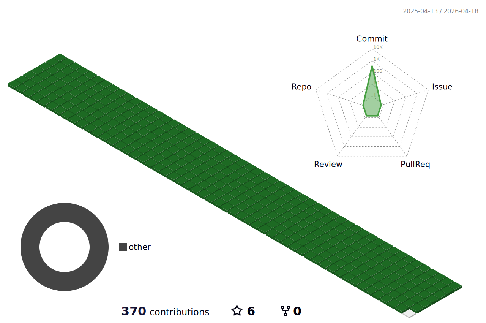

# GGENGMO 👋

<!--
**ggengmo/ggengmo** is a ✨ _special_ ✨ repository because its `README.md` (this file) appears on your GitHub profile.

Here are some ideas to get you started:

- 🔭 I’m currently working on ...
- 🌱 I’m currently learning ...
- 👯 I’m looking to collaborate on ...
- 🤔 I’m looking for help with ...
- 💬 Ask me about ...
- 📫 How to reach me: ...
- 😄 Pronouns: ...
- ⚡ Fun fact: ...
-->

# ⚙ Skills
## 🖥 BackEnd

  
  

## 💾 DataBase

  

## 🎨 FrontEnd

  
  
  
  
  

## 🛠 Tools

  
  
  
  
  
  

